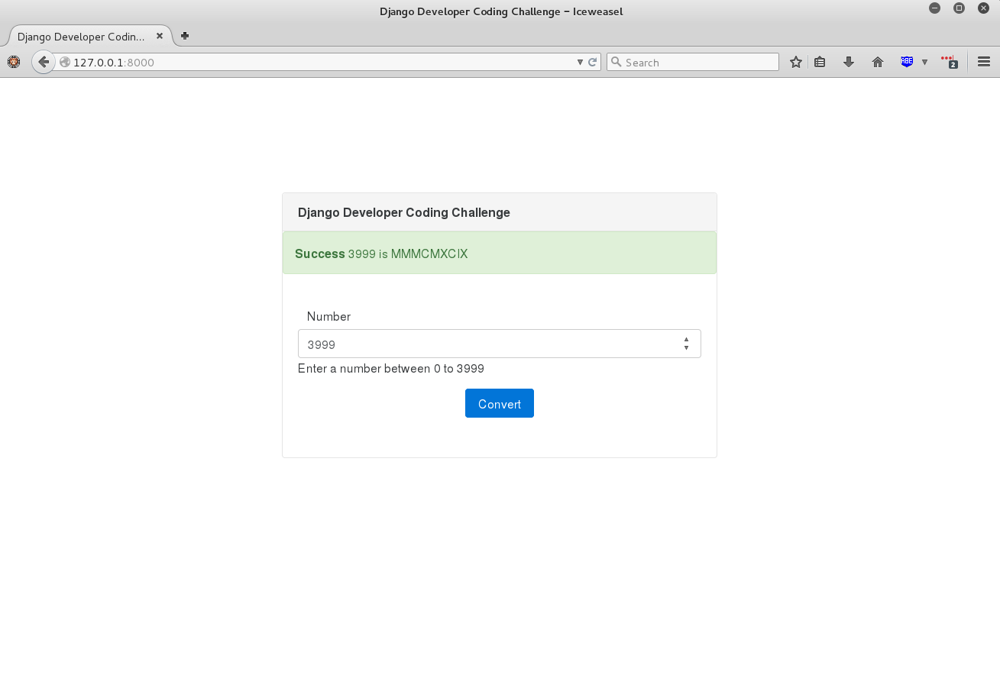

# Django Developer Coding Challenge

## Prerequisites

## Installation

In the top level directory **celerity-challenge** we need to do the following.

 * Setup the virtual environment
 * Install project dependencies

    cd celerity-challenge

Setup the virtual environment

    virtualenv env
    source env/bin/activate
    
Install project dependencies

    pip install -r requirements.txt

Create tables

    python manage.py makemigrations
    python manage.py migrate
    

## QA/Testing

Check for pep8 style conventions

    pep8 celeritychallenge

TODO: Write and run unit tests

    python manage.py test

## Local Execution

    python manage.py runserver

## Structure

    celerity-challenge
        apps                      # Modular apps 
            wemail                # The app for sending emails. 
            
        celeritychallenge         # Global and shared components
            static
            templates
            local_settings.py     # Local setting for development
            settings.py
            urls.py
            wsgi.py
    
    .gitignore
    manage.py
    README.md
    requirements.txt
    setup.py
    weatherapp.log

